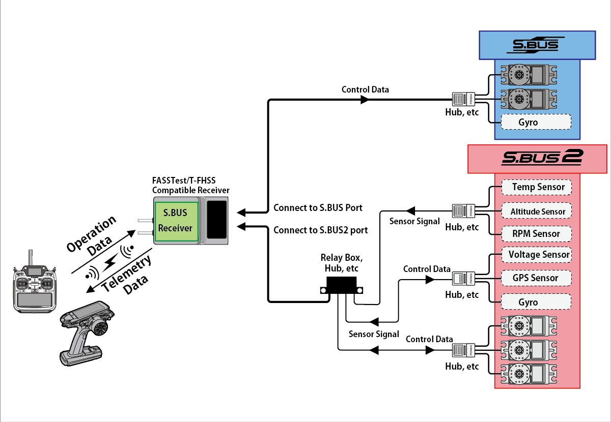
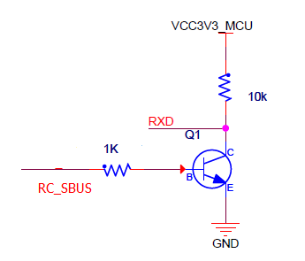
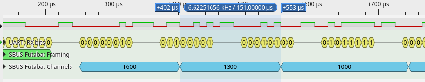

.. _futabasbus:

Futaba SBus
===========

The Futaba S.Bus protocol was introduced around 2009. It was developed by Futaba, a leading manufacturer of RC systems, to address the limitations of traditional PWM (Pulse Width Modulation) systems used for RC control. Unlike PWM, which requires separate wires for each channel, S.Bus uses a single serial connection to transmit data for multiple channels, reducing the complexity of wiring in RC models.

Specifications
--------------

- `Physical Layer`_
- `Message Format`_

.. _physical_sbus:

Physical Layer
--------------

The physical layer of the Futaba SBus protocol utilizes UART (Universal Asynchronous Receiver-Transmitter) communication at a baud rate of 100000.

UART Configuration
^^^^^^^^^^^^^^^^^^

The configuration of the UART communication for SBus uses the following format:

- **8 bits of data**: Each data frame consists of 8 bits, representing the information being transmitted.
- **Even parity**: With even parity, the number of bits set to 1 in each 8-bit data frame, including the parity bit, must be an even number.
- **2 stop bits**: Following the data bits and the parity bit, there are 2 stop bits. Stop bits indicate the end of a data frame and provide timing for the receiving device to process the data.

Inversion
^^^^^^^^^

For using SBus with a microcontroller, an inverter is typically required for the inverted UART logic level. This inversion is necessary because traditional UART operates with an active high level, while SBus uses inverted UART with an active low level.

.. _format_sbus:

Message Format
---------------

The SBus protocol uses a specific message format for transmitting control data from the transmitter to the receiver.

- **Byte[0]**: SBUS header (0x0F): The message begins with a header byte, which serves as the start indicator for the S.Bus message. This byte is fixed at `0x0F`, indicating the beginning of a new S.Bus frame.

- **Byte[1 - 22]**: 16 servo channels, 11 bits each: The next 22 bytes are allocated for servo channel data. Each servo channel occupies 11 bits, allowing for precise control over servo positions. This section contains information about the positions of up to 16 servo channels.

- **Byte[23]**: Additional status indicators:

  - **Bit 0**: Channel 17
  - **Bit 1**: Channel 18
  - **Bit 2**: Frame lost
  - **Bit 3**: Failsafe activated

  These bits provide information about the status of channels 17 and 18, as well as indications of frame loss and failsafe activation.

- **Byte[24]**: SBUS footer (0x00): The message concludes with a footer byte, marking the end of the S.Bus frame.